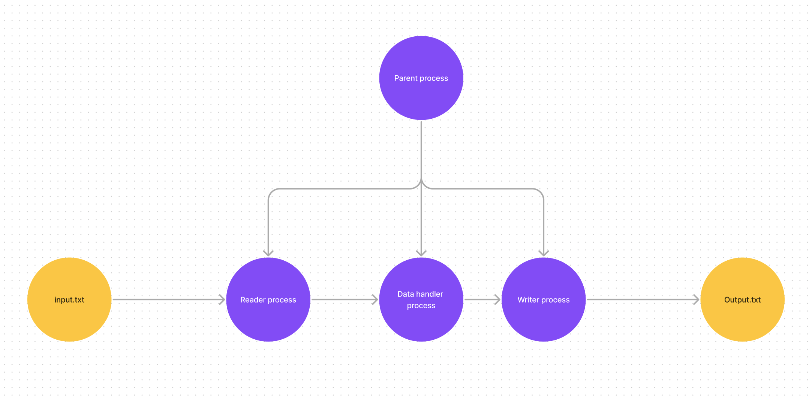

# Отчет ИДЗ 1
Хамид Карим Мохамадович БПИ 214 \
Вариант 26 \
Работа выполнена на оценку _
### Задание: 
Разработать программу, которая определяет количество целых чисел в ASCII-строке. Числа состоят из цифр от 0 до 9. Разделителями являются все другие символы.

---- 
Использовались буферы размера 10000 байт, поэтому удовлетворяет задаче использования минимум 5000 байтного буфера.

Для решения проблемы доступа к ресурсу чтения и записи(тут это каналы) использовал семафоры.

Тестовые файлы и результат их работы находятся в папке test. Файлы одинаковые для всех оценок, так как программа обработчик одна и та же и нет смысла делать разные файлы.

----

### На оценку 4
Общая схема решаемой задачи: 




Для запуска программы, необходимо ввести команду: 
```shell
$ gcc main.c -o main -lpthread
$ ./main ../tests/input1.txt ../tests/output1.txt
reader started
Reader exit
process started
Process exit
writer started
Writer exit

Parent: All children have exited.
```
Как видим, все сработало без ошибок. Проверим файл output1.txt в папке tests:
```shell
11
```
Как видим, программа работает корректно. 

Работа с файлами производится с помощью системных вызовов open, read, write, close. Для синхронизации доступа к каналам используются семафоры.

Выполнены все требования к оценке 4.

### На оценку 5
Общая схема(каналы были созданы с помощью функции mknod): 


Пример запуска программы, где последний аргумент это имя канала:
```shell
$ gcc main.c -o main -lpthread
$ ./main ../tests/input1.txt ../tests/output1.txt main.fifo
reader started
Reader exit
process started
Process exit
writer started
Writer exit

Parent: All children have exited.
```
Код проходит все тесты. Синхронизирован с помощью семафоров.

### На оценку 6